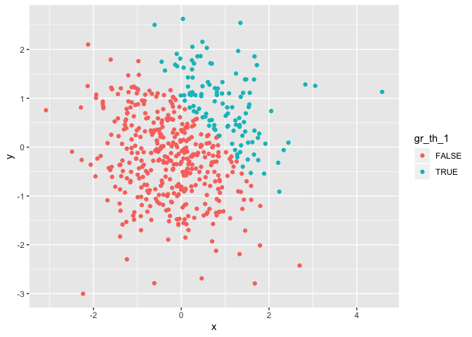
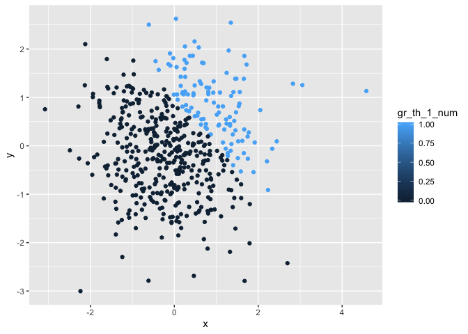

p8105\_hw1\_al3998
================
AimingLiu
9/15/2019

# Problem 1

This is the first code chunk for Problem
    1

``` r
library(tidyverse)
```

    ## ── Attaching packages ───────────────────────────────────────── tidyverse 1.2.1 ──

    ## ✔ ggplot2 3.2.1     ✔ purrr   0.3.2
    ## ✔ tibble  2.1.3     ✔ dplyr   0.8.3
    ## ✔ tidyr   0.8.3     ✔ stringr 1.4.0
    ## ✔ readr   1.3.1     ✔ forcats 0.4.0

    ## ── Conflicts ──────────────────────────────────────────── tidyverse_conflicts() ──
    ## ✖ dplyr::filter() masks stats::filter()
    ## ✖ dplyr::lag()    masks stats::lag()

``` r
pr_df=tibble(
   ra_sample = rnorm(8),
    gr_th_0 = ra_sample>0,
    var_char = c("This","is","my","eight","characters","in","problem","one"),
    var_fac = factor(c("child","adult","elder","adult","elder","adult","child","adult"),levels=c("child","adult","elder"))
)
```

\#Take the mean The variable ra\_sample has a mean of 0.3210358,and the
variable gr\_th\_0 has a mean of 0.625. The mean of variable `var_char`
is NA,the mean of variable `var_fac` is NA

``` r
as.numeric(pull(pr_df,gr_th_0))
as.numeric(pull(pr_df,var_char))
as.numeric(pull(pr_df,var_fac))
```

Here is the second chunk in problem
1.

``` r
#convert the logical vector to numeric, and multiply the random sample by the result#
gr_th_0_num = as.numeric(pull(pr_df,gr_th_0))
(gr_th_0_num)*(pull(pr_df,ra_sample))
```

    ## [1] 0.000000000 0.001320336 0.401702894 1.214948273 0.000000000 0.722778602
    ## [7] 0.000000000 0.516524063

``` r
#convert the logical vector to a factor, and multiply the random sample by the result#
gr_th_0_fac = as.factor(pull(pr_df,gr_th_0))
(gr_th_0_fac)*(pull(pr_df,ra_sample))
```

    ## Warning in Ops.factor((gr_th_0_fac), (pull(pr_df, ra_sample))): '*' not
    ## meaningful for factors

    ## [1] NA NA NA NA NA NA NA NA

``` r
#convert the logical vector to a factor and then convert the result to numeric, and multiply the random sample by the result#
gr_th_0_facnum = as.numeric(gr_th_0_fac)
(gr_th_0_facnum)*(pull(pr_df,ra_sample))
```

    ## [1] -0.091640917  0.002640671  0.803405788  2.429896546 -0.058960112
    ## [6]  1.445557205 -0.138387061  1.033048125

# Problem 2

This is the code chunk for problem 2

``` r
pr2_df=tibble(
  x = rnorm(500),
  y = rnorm(500),
  gr_th_1 = x+y>1,
  gr_th_1_num = as.numeric(gr_th_1),
  gr_th_1_fac = as.factor(gr_th_1)
)
```

The size of the data set can be described through the row and column of
it.The column of the data set is 5 and the row of the data set is 500.

The mean of x can be described as 0.05202. The median of x can be
described as 0.0733167. The standard deviation of x can be described as
1.0383948.

The proportion of cases for which x+y\>1 can be described as 0.24.

### The scatterplot of y vs x

``` r
ggplot(pr2_df,aes(x=x,y=y))+geom_point(aes(color=gr_th_1))
```

<!-- -->

### The scatterplot of numeric variables

``` r
ggplot(pr2_df,aes(x=x,y=y))+geom_point(aes(color=gr_th_1_num))
```

<!-- -->

### The scatterplot of factor variables

``` r
ggplot(pr2_df,aes(x=x,y=y))+geom_point(aes(color=gr_th_1_fac))
```

<!-- -->

``` r
logical_plot=ggplot(pr2_df,aes(x=x,y=y))+geom_point(aes(color=gr_th_1))
ggsave("scatterplot1.pdf",logical_plot,height = 8,width = 5)
```
